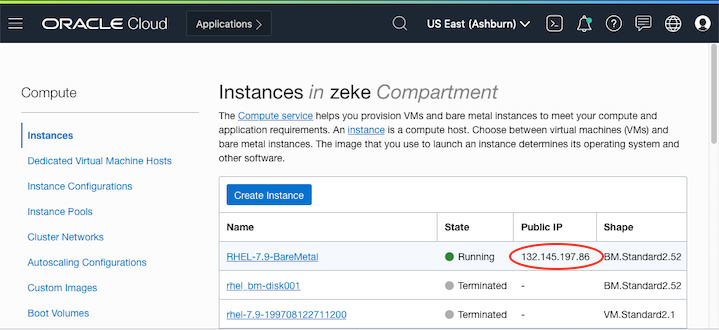

# Bring Your Own Image into OCI
## Overview

This repository contains various Packer templates for spinning up images in VirtualBox that can be exported to OCI.

## Prerequisites
 * [Packer](https://www.packer.io/) (last tested with version 1.5.4)
 * [VirtualBox](https://www.virtualbox.org/) (last tested with version 6.1.16)
 * [VirtualBox Extension Pack](https://www.virtualbox.org/wiki/Downloads) (must match VBox version)
 * In order to export your image into your OCI tenancy, you must link your VirtualBox installation with your OCI account. Those instructions can be found [here](http://www.oracle.com/us/technologies/virtualization/oracle-vm-vb-oci-export-20190502-5480003.pdf). If you have the OCI CLI installed and the config in the standard location VBox can pick it up automatically. Be sure all values are set, eg compartment.

 Notes on `.gitignore`: the `./iso` directory is ignored, as is `packer_cache`. The
 .json files here use the convention of `packer-something` for their build directories
 which are ignored as well.

## Build the VirtualBox Image
Run the Packer build command using the (non Bare Metal) json templates.
```
## Usage
$> cd oci-byo-image
$> packer build <packer_template>

## Examples
$> packer build debian-10.6-i386.json
$> packer build rhel-7.9.json
```

*NOTE: This command will only work for the Red Hat image if you've downloaded the Redhat 7.9 ISO installation file. You must register for a [Red Hat developer account](https://sso.redhat.com/auth/realms/redhat-external/login-actions/registration?client_id=rhd-web&tab_id=TPAJPLu9Cnk) to get access to it.*


## Export Virtual Image to OCI
Once complete, the image can be exported to an Object Storage bucket in your OCI account. The following command will export the image, create a custom image, and spin up an instance. You must create an Object Storage bucket and VCN with a public network in your tenancy as the command below refers to the name of the Object Storage bucket and the OCIDs of the networks.

```
## Export image to OCI
$> VBoxManage export debian-10.6-12997... \
      --output OCI:// \
      --cloud 0 \
      --vmname debian_10_6_vb \
      --cloudprofile DEFAULT \
      --cloudbucket vbox-upload \
      --cloudlaunchmode PARAVIRTUALIZED \
      --cloudshape VM.Standard2.1 \
      --clouddomain IYfK:US-ASHBURN-AD-1 \
      --clouddisksize 120 \
      --cloudocivcn ocid1.vcn.oc1.iad.amaaa... \
      --cloudocisubnet ocid1.subnet.oc1.iad.aaaaa... \
      --cloudkeepobject true \
      --cloudlaunchinstance true \
      --cloudpublicip true
```

Now log into the instance using the credentials specified in the kickstart file (under the ```http``` directory). All the examples in this repository setup a `opc` user and a `root` user. The default password for both accounts is `opc`:

## Bare Metal Images:
## Build the Bare Metal VirtualBox Image
In order to create a Bare Metal instance OCI, we must perform a slightly altered workflow. The following example creates a Redhat 7.9 Bare Metal instance in OCI from the Red Hat 7.9 installation ISO media:

Run the Packer build command using the Bare Metal json template.
```
$> cd oci-byo-image
$> packer build rhel-7.9-BM.json
```
*NOTE: This command will only work if you've downloaded the Redhat 7.9 ISO installation file. You must register for a [Red Hat developer account](https://sso.redhat.com/auth/realms/redhat-external/login-actions/registration?client_id=rhd-web&tab_id=TPAJPLu9Cnk) to get access to it.*

## Export Bare Metal Image to OCI
Once complete, the image can be exported to an Object Storage bucket in your OCI account. The following command will export the image to your bucket and create a custom image in your tenancy. You must create an Object Storage bucket in your tenancy as the command below refers to it:
```
$> VBoxManage export rhel-7.9-BM-19970... \
      --output OCI:// \
      --cloud 0 \
      --vmname rhel-7.9-BM-19970... \
      --cloudprofile DEFAULT \
      --cloudbucket vbox-upload \
      --cloudlaunchmode PARAVIRTUALIZED
 ```

 When the image is finished exporting, login into your tenancy and add ```BM.Standard2.52``` to the list of compatible shapes.

 

 Create an instance from the custom image:

 

 SSH into into image:

 ```
 $> ssh opc@132.145.197
 [opc@instance-20210128-1610 ~]$ cat /etc/redhat-release
 Red Hat Enterprise Linux Server release 7.9 (Maipo)
 ```

 
