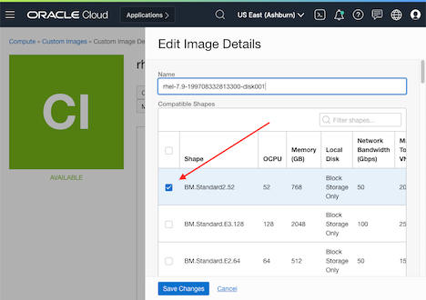
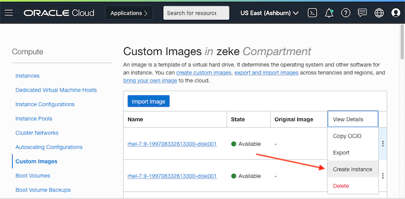

# Bring Your Own Image into OCI, using Packer and VirtualBox
## Overview

This repository contains various Packer templates for spinning up images in VirtualBox that can be exported to OCI.

## Building the Vagrant Boxes

```
## Usage
$> packer build <packer_template>

## Examples 
$> packer build debian-10.6-i386.json
$> packer build rhel-7.9.json
```

*NOTE: This command will only work for the Red Hat image if you've downloaded the Redhat 7.9 ISO installation file. You must register for a [Red Hat developer account](https://sso.redhat.com/auth/realms/redhat-external/login-actions/registration?client_id=rhd-web&tab_id=TPAJPLu9Cnk) to get access to it.*


## Export Image to OCI
Once complete, the image can be exported to an Object Storage bucket in your OCI account. The following command will export the image, create a custom image, and spin up an instance. You must create an Object Storage bucket and VCN with a public network in your tenancy as the command below refers to the name of the Object Storage bucket and the OCIDs of the networks.

*NOTE: For this command to work, you must link your VirtualBox installation with your OCI account. Those instructions can be found [here](http://www.oracle.com/us/technologies/virtualization/oracle-vm-vb-oci-export-20190502-5480003.pdf#%5B%7B%22num%22%3A47%2C%22gen%22%3A0%7D%2C%7B%22name%22%3A%22XYZ%22%7D%2C51%2C727%2C0%5D).*

```
## Export image to OCI
$> VBoxManage export debian-10.6-12997... \
      --output OCI:// \
      --cloud 0 \
      --vmname fedora_32_vb \
      --cloudprofile DEFAULT \
      --cloudbucket vbox-upload \
      --cloudlaunchmode PARAVIRTUALIZED \
      --cloudshape VM.Standard2.1 \
      --clouddomain IYfK:US-ASHBURN-AD-1 \
      --clouddisksize 120 \
      --cloudocivcn ocid1.vcn.oc1.iad.amaaa... \
      --cloudocisubnet ocid1.subnet.oc1.iad.aaaaa... \
      --cloudkeepobject true \
      --cloudlaunchinstance true \
      --cloudpublicip true
```

Now log into the instance using the credentials specified in the kickstart file (under the ```http``` directory). All the examples in this repository setup a `opc` user and a `root` user. The default password for both accounts is `opc`:


## Bare Metal Instances
In order to create a Bare Metal instance OCI, we must perform a slightly altered workflow. The following example creates a Redhat 7.9 Bare Metal instance in OCI from the Red Hat 7.9 installation ISO media:

1. Run the Packer build command. 
```
$> packer build rhel-7.9-BM.json
```
*NOTE: This command will only work if you've downloaded the Redhat 7.9 ISO installation file. You must register for a [Red Hat developer account](https://sso.redhat.com/auth/realms/redhat-external/login-actions/registration?client_id=rhd-web&tab_id=TPAJPLu9Cnk) to get access to it.*

2. Once complete, the image can be exported to an Object Storage bucket in your OCI account. The following command will export the image to your bucket and create a custom image in your tnenacy. You must create an Object Storage bucket  in your tenancy as the command below refers to it:
```
$> VBoxManage export rhel-7.9-BM-19970... \
      --output OCI:// \
      --cloud 0 \
      --vmname rhel-7.9-BM-19970... \
      --cloudprofile DEFAULT \
      --cloudbucket vbox-upload \
      --cloudlaunchmode PARAVIRTUALIZED
 ```
 *NOTE: For this command to work, you must link your VirtualBox installation with your OCI account. Those instructions can be found [here](http://www.oracle.com/us/technologies/virtualization/oracle-vm-vb-oci-export-20190502-5480003.pdf#%5B%7B%22num%22%3A47%2C%22gen%22%3A0%7D%2C%7B%22name%22%3A%22XYZ%22%7D%2C51%2C727%2C0%5D).*
 
 3. When the image is finished exporting, login into your tenancy and add ```BM.Standard2.52``` to the list of compatible shapes. 
 
 
 
 4. Create an instance from the custom image:
 
 
 
 5. SSH into into image:
 
 ```
 $> ssh opc@132.145.197
 [opc@instance-20210128-1610 ~]$ cat /etc/redhat-release 
 Red Hat Enterprise Linux Server release 7.9 (Maipo)
 ```
 
 
 
 
 
 
 


